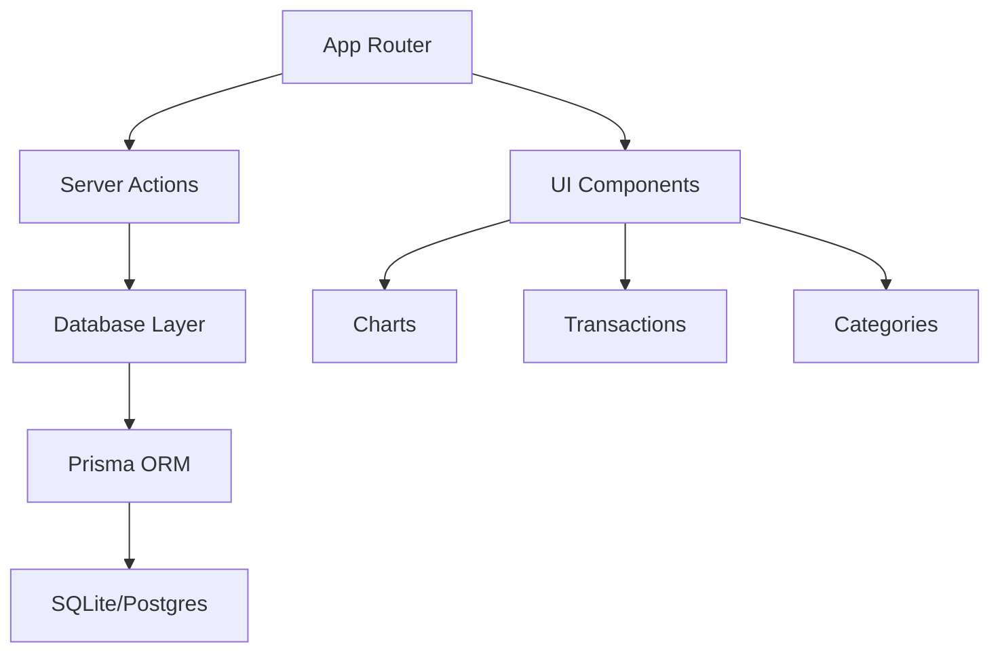
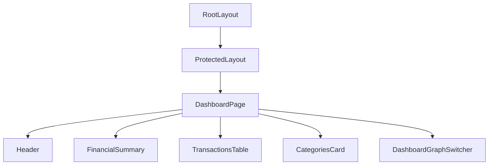
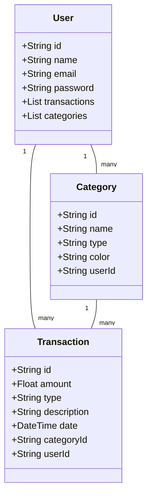
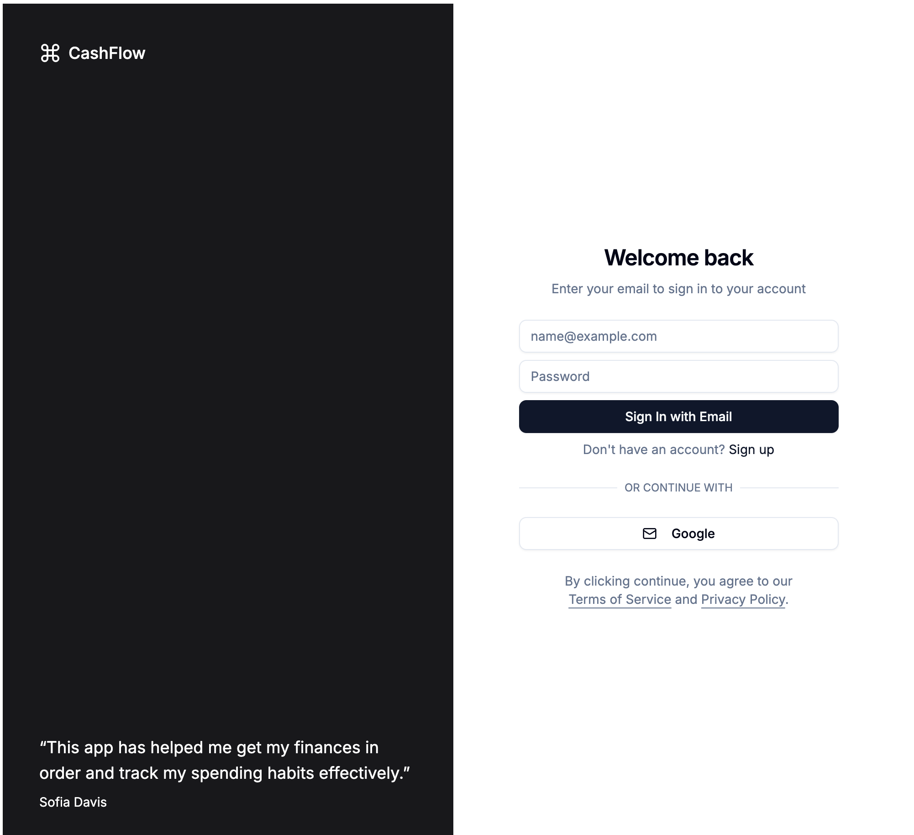
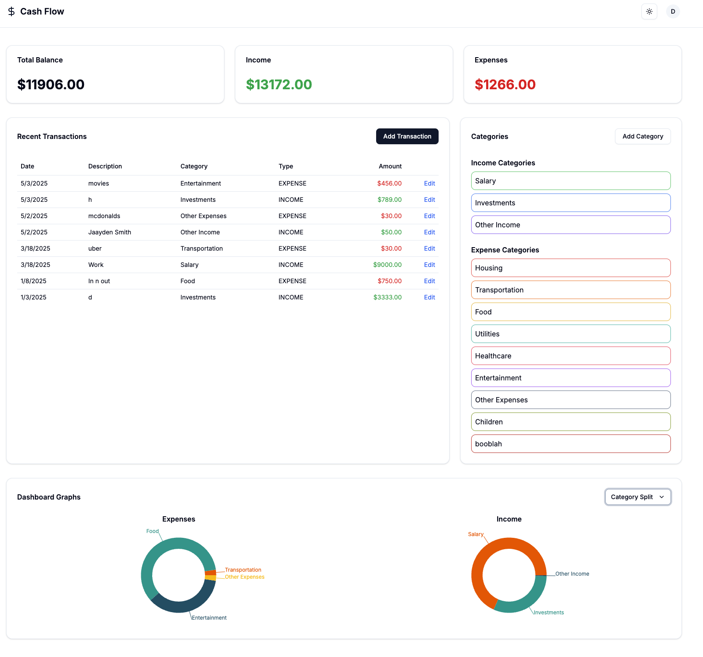
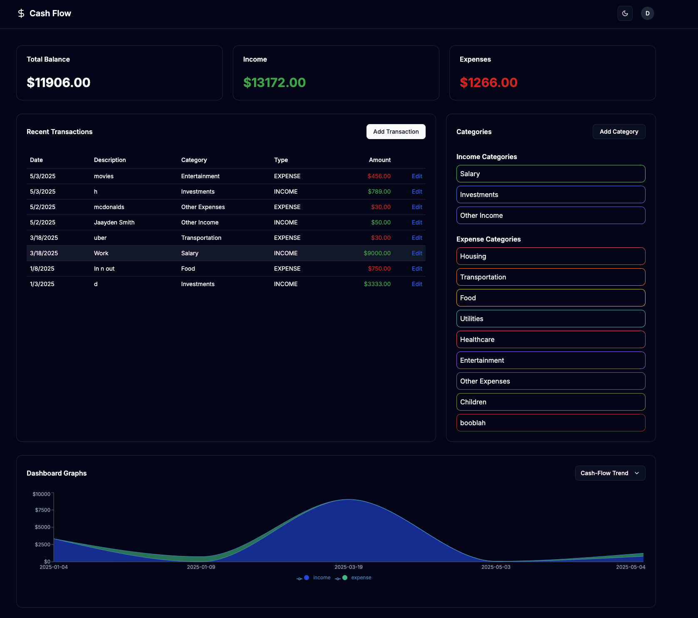

# CashFlow

A modern web application for tracking personal finances, built with Next.js 14, Prisma, React, and shadcn/ui.

## Overview

CashFlow helps users manage their income, expenses, and overall financial health through a clean dashboard, interactive charts, and category management. The application is designed to be user-friendly, modular, and maintainable.

## Key Features

- Secure user authentication and session management
- Interactive dashboard with financial summaries and charts
- CRUD operations for transactions and categories
- Real-time data visualization using Recharts
- Responsive and modern UI with shadcn/ui

## Architecture

CashFlow follows a modern Next.js 14 architecture with the following key components:

- **App Router**: Handles routing and separates protected/auth routes.
- **Server Actions**: Manages data mutations and queries.
- **UI Components**: Built with shadcn/ui, organized by feature.
- **Database Layer**: Prisma ORM with SQLite (development) or Postgres (production).

### High-Level Architecture Diagram



### Component Hierarchy Diagram



### Database Class Diagram



## Setup Instructions

1. **Clone the repository**:
   ```bash
   git clone https://github.com/yourusername/CashFlow.git
   cd CashFlow
   ```

2. **Install dependencies**:
   ```bash
   npm install
   ```

3. **Set up environment variables**:
   Create a `.env` file in the root directory with the following variables:
   ```
   DATABASE_URL=your_database_url
   NEXTAUTH_SECRET=your_nextauth_secret
   NEXTAUTH_URL=http://localhost:3000
   ```

4. **Run the development server**:
   ```bash
   npm run dev
   ```

5. **Open your browser** and navigate to `http://localhost:3000`.

## Contributing

Contributions are welcome! Please feel free to submit a Pull Request.

## License

This project is licensed under the MIT License.

---

*Prepared by Vedi, Veronica, and Luis for the GUI Final Project, Spring 2024.*

## Screenshots

Here are some screenshots of the CashFlow application:

- **Sign In Page**: 
- **Dashboard**: 
- **Transaction Management**: 
