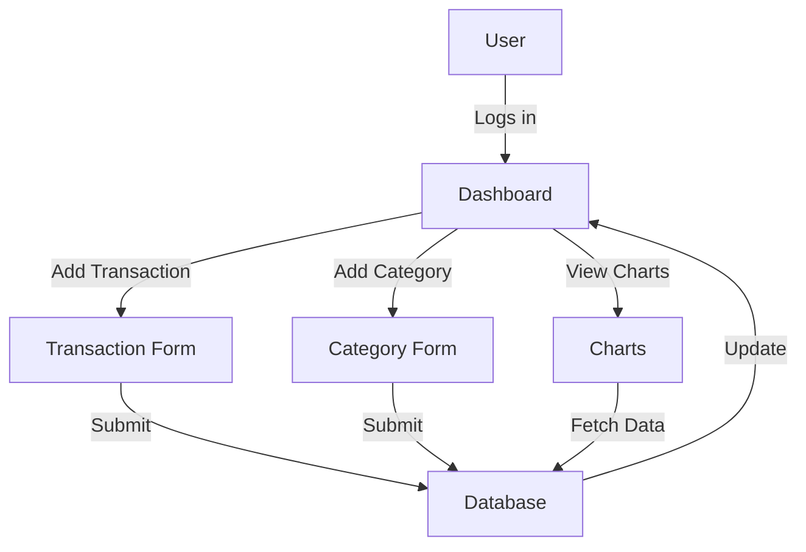
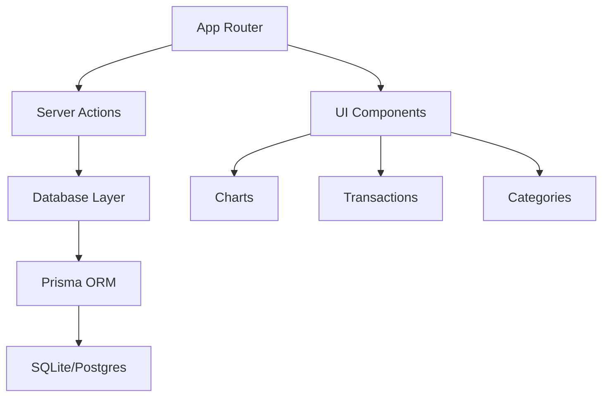
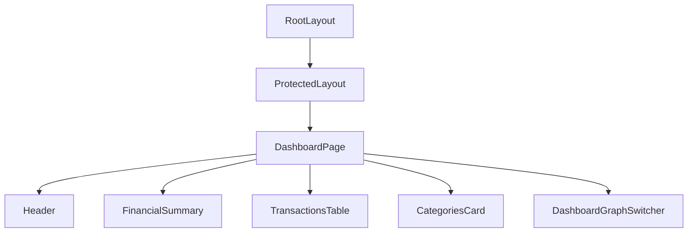
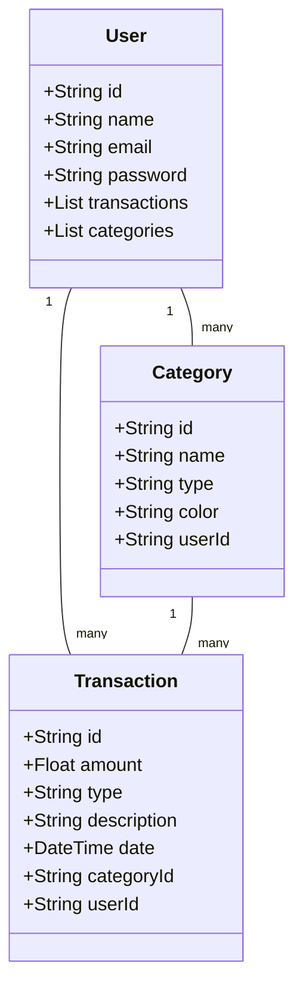
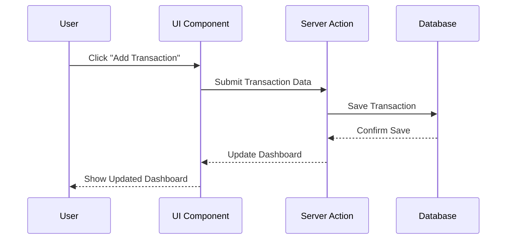

# CashFlow
Architecture/Design Document

## Table of Contents
1. [INTRODUCTION](#1-introduction)
2. [DESIGN GOALS](#2-design-goals)
3. [SYSTEM BEHAVIOR](#3-system-behavior)
4. [LOGICAL VIEW](#4-logical-view)
   - [4.1 High-Level Design (Architecture)](#41-high-level-design-architecture)
   - [4.2 Mid-Level Design](#42-mid-level-design)
   - [4.3 Detailed Class Design](#43-detailed-class-design)
5. [PROCESS VIEW](#5-process-view)
6. [DEVELOPMENT VIEW](#6-development-view)
7. [PHYSICAL VIEW](#7-physical-view)
8. [USE CASE VIEW](#8-use-case-view)

## Change History
- **Version: 1.0**  
  **Modifier:** Vedi, Veronica, Luis  
  **Date:** 05/06/2024  
  **Description of Change:** Complete draft for GUI final project.

---

## 1. INTRODUCTION
This document describes the architecture and design for the CashFlow application, developed as our final project for the Graphic User Interfaces course. CashFlow is a modern web app that helps users track their income, expenses, and overall financial health through a clean dashboard, interactive charts, and category management. The app is built with Next.js 14, Prisma, React, and shadcn/ui, and follows best practices for modular, maintainable, and user-friendly design.

The purpose of this document is to explain the organization of the code and design decisions for CashFlow, addressing the interests of all major stakeholders:

- **Users** – want a reliable, easy-to-use, and visually clear dashboard for managing personal finances.
- **Developers (us)** – want a codebase that is easy to extend, debug, and maintain.
- **Project Manager (Luis)** – wants clear module boundaries and a logical division of work.
- **Maintenance Programmers** – want a system that is easy to evolve and update in the future.

We present the architecture from four perspectives: Logical, Process, Development, and Use Case views, as recommended by Krutchen's 4+1 model.

---

## 2. DESIGN GOALS
The design priorities for CashFlow are:
- Minimize complexity and development effort.
- Prioritize usability and visual clarity for end users.
- Ensure modularity and separation of concerns (UI, business logic, data access).
- Support easy future extension (e.g., new chart types, more analytics).
- Use modern frameworks and best practices learned during the course.

---

## 3. SYSTEM BEHAVIOR
CashFlow allows users to:
- Log in securely and access their personal dashboard.
- Add, edit, and delete transactions (income/expense).
- Add, edit, and delete categories.
- View financial summaries and trends via interactive charts.
- Filter and review recent transactions.
- Visualize income/expense breakdowns by category and over time.

### System Behavior Diagram

---

## 4. LOGICAL VIEW
The main functional components of CashFlow are:
- **Authentication**: Handles user login and session management (NextAuth.js).
- **Dashboard**: Main UI for financial overview, charts, and quick actions.
- **Transactions**: CRUD operations for income/expense records.
- **Categories**: CRUD operations for user-defined categories.
- **Charts**: Data visualization (Recharts, shadcn/ui).
- **Database Layer**: Prisma ORM with SQLite (dev) or Postgres (prod).

### 4.1 High-Level Design (Architecture)
The high-level architecture consists of the following modules:
- **App Router**: Next.js routing, separates protected/auth routes.
- **Server Actions**: Handles all data mutations and queries.
- **UI Components**: Built with shadcn/ui, organized by feature.
- **Data Models**: User, Transaction, Category (see technical docs).

#### High-Level Architecture Diagram

### 4.2 Mid-Level Design
- **Component Hierarchy**: RootLayout → ProtectedLayout → DashboardPage → [Header, FinancialSummary, TransactionsTable, CategoriesCard, DashboardGraphSwitcher].
- **State Management**: Server state via Server Components/Actions, client state for dialogs/forms.
- **Data Flow**: Server Actions fetch/mutate data, pass to UI via props.
- **Charts**: All charts are client components, receive only data as props.

#### Component Hierarchy Diagram

### 4.3 Detailed Class Design
- **Transaction**: id, amount, type, description, date, categoryId, userId.
- **Category**: id, name, type, color, userId.
- **User**: id, name, email, password.
- **Key UI Components**: TransactionsTable, DashboardGraphSwitcher, Add/Edit Dialogs.

#### Database Class Diagram

---

## 5. PROCESS VIEW
- All data mutations (add/edit/delete) are handled via Next.js Server Actions.
- Authentication is checked on every protected route.
- Charts and interactive UI are client components, but receive all data from server components.
- No background jobs or multi-threading; all user actions are synchronous.

---

## 6. DEVELOPMENT VIEW
- **Frontend**: Next.js 14 (App Router), React 18, shadcn/ui, Recharts, Tailwind CSS.
- **Backend**: Next.js API routes (for auth), Prisma ORM, SQLite/Postgres.
- **Dev Tools**: VS Code, ESLint, Prettier, Prisma Studio.
- **Team Workflow**: GitHub for version control, feature branches, code reviews.
- **Key Skills Learned**: Next.js App Router, Server Actions, Prisma, shadcn/ui, advanced React patterns, data visualization.

---

## 7. PHYSICAL VIEW
- **Local Dev**: Node.js server, SQLite database.
- **Production**: Vercel deployment, Postgres database.
- **Static Assets**: Served via Next.js static file handling.

---

## 8. USE CASE VIEW
- **Add Transaction**: User clicks "Add Transaction", fills form, submits; transaction is saved and dashboard updates.
- **Edit Category**: User clicks "Edit" on a category, updates name/color, saves; category updates everywhere.
- **View Trends**: User selects different charts from the dashboard to analyze cash flow, category splits, and monthly trends.

#### Sequence Diagram for Adding a Transaction

---

## TODOs for Team
- [x] Add system behavior diagram
- [x] Add high-level architecture diagram
- [x] Add component hierarchy and sequence diagrams
- [x] Add class diagrams for main models/components
- [x] Confirm production database details
- [x] Review and polish prose for final submission

---

*Prepared by Vedi, Veronica, and Luis for the GUI Final Project, Spring 2024.*
